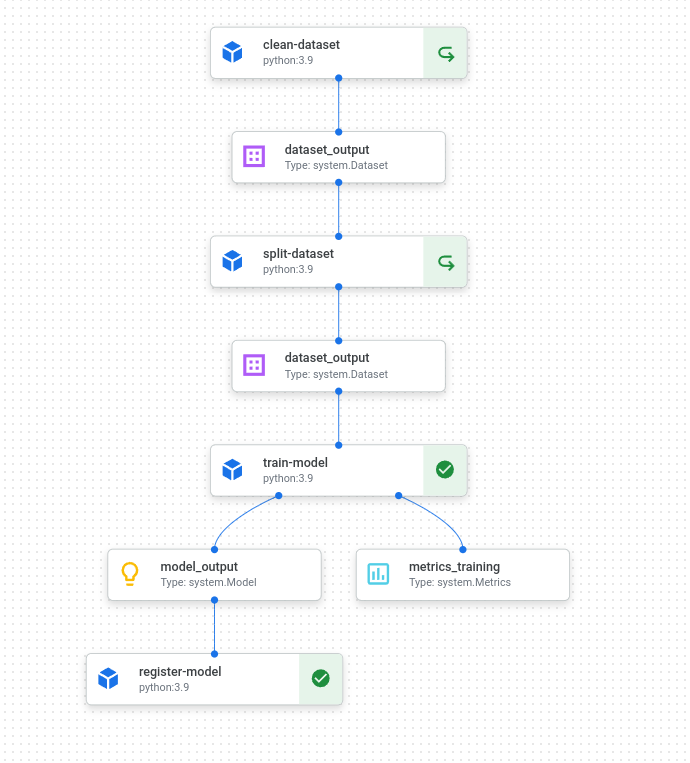
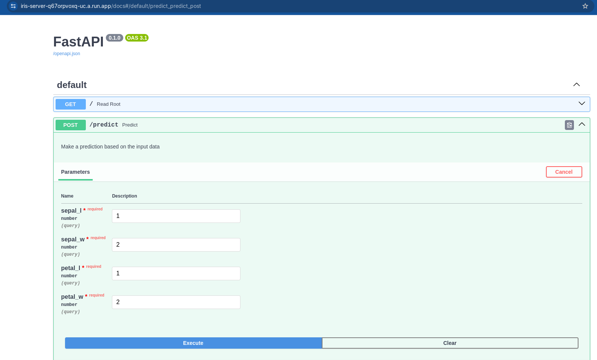

# sapiens-project

This is a project to deploy a model to predict the species of an iris flower. It uses a pipeline to train the model and then deploys it to a server. The server is deployed in a docker container and then to cloud run.




## Setup


Install the dependencies using. It's recommended using a virtual env like conda
```
poetry install
```

Make sure you have set up your gcp account

## Prepare Input Dataset
This will create a bucket with the dataset
```
cd infrastructure
pulumi up
``` 

## Compile and execute the training pipeline

This should generate a yaml file 
``` 
python pipeline/compile.py
```

Then execute the pipeline with
```
python pipeline/run.py 
```

## Launch the docker model server locally 

### Update dependencies
```
bash scripts/gen-requirements.txt
```

### Compile docker
```
scripts/compile-docker.sh
``` 

### Run the server
This will obtain the credentials from your ${HOME}/.config/gcloud folder
```
scripts/run-docker.sh
``` 

Then access to the route /docs to interact with the predict function

## Running on Cloud Run

### Fast access:
Public access:
https://iris-server-q67orpvoxq-uc.a.run.app/docs#/default/predict_predict_post

### Pushing image to registry

``` 
gcloud auth configure-docker \
    us-central1-docker.pkg.dev

docker tag iris_server:latest us-central1-docker.pkg.dev/sapiens-417017/images/iris_server
docker push us-central1-docker.pkg.dev/sapiens-417017/images/iris_server

```

## Folder Structure
- infrastructure: Scripts for setting up the bucket
- pipeline : Components and scripts to launch the pipeline in vertex
- server: Contains the server app with the model 

## Need Support??
Write an email to luantber@gmail.com to run this 